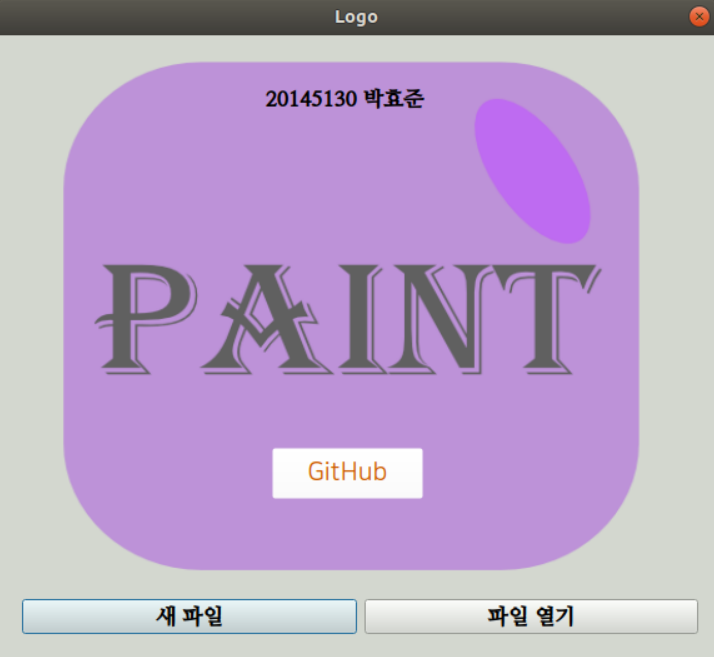
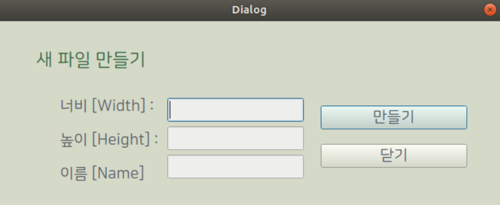
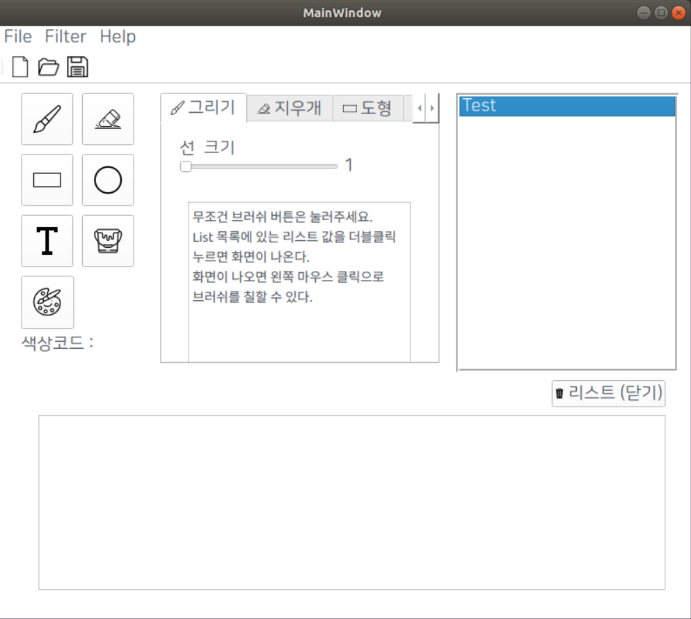
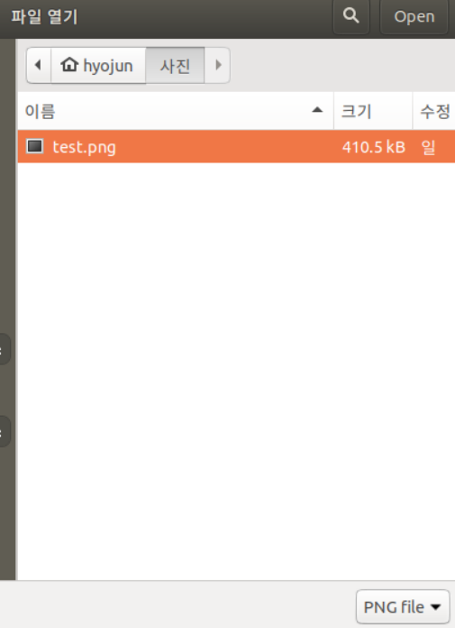
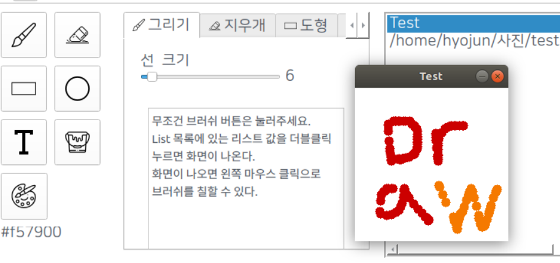
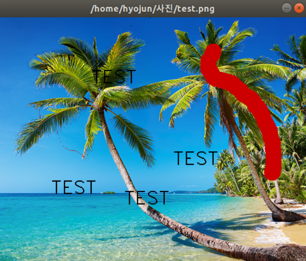
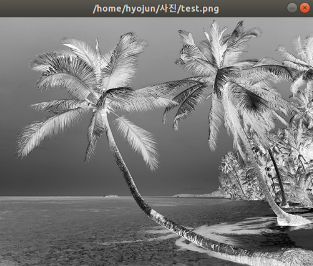
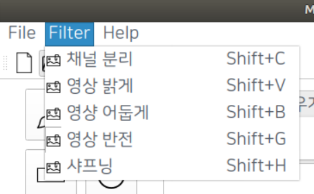
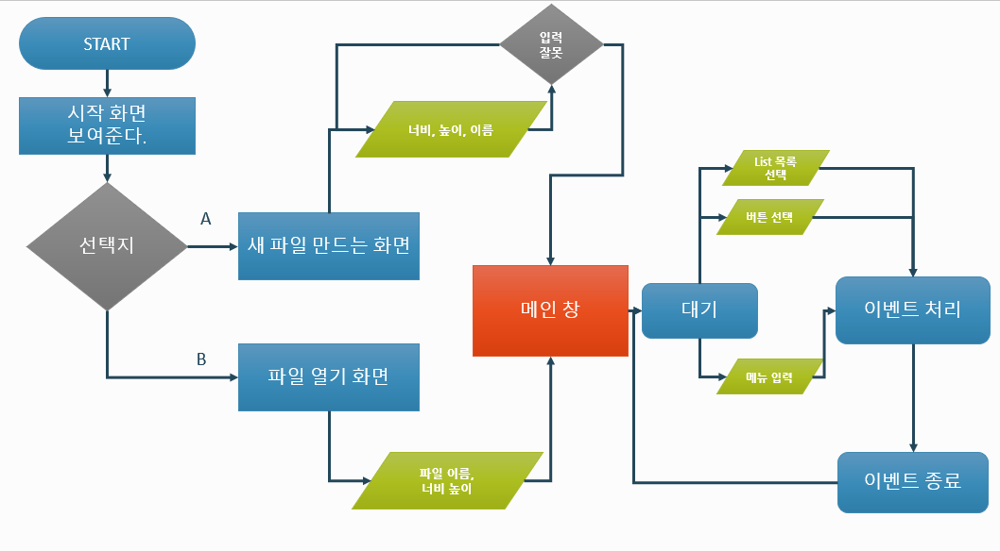
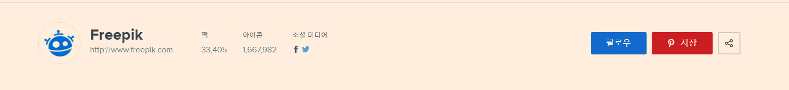

# Name : Paint_Project

#### Member : (20145130 박효준)

### 소개 및 개발 내용

- 일반적인 그림판 을 QT + OpenCV + Ubuntu  사용해서 만들었습니다.
- QT 프레임워크 는 GUI 를 만들었으며, OpenCV는 그림판 의 그리기를 담당했습니다.

------
### 맴버 역활

- 박효준
  - QT 를 배우고 이용해서 GUI 제작
  - OpenCV 를 배우고 QT랑 연동하여  사용
  - 코딩

---

#### 소개 및 개발 내용

- 이 프로그램은 시스템 프로그래밍 소규포 프로젝트 과제로 만들었으며, QT 프레임워크, OpenCV, Virtual Box Ubuntu를 사용하여 제작했다.

- <b>QT란 ?</b>

  - 기본 언어를 C++로 하는 GUI 제작 크로스 플랫폼 프레임워크 이다.

  - 다양한 언어로도 사용이 가능하며, GUI, 웹앱 제작이 아주 편리하다.

  - 오픈소스

  - QT로 제작된 대표적인 예

    - 구글어스
    - 스카이프
    - KED(리눅스 운영체제)
    - Maya

  - 상업버전으로 돈 주고 사용할 경우 소스 공개 하지 않아도 된다.

  - [Ubuntu QT]: https://webnautes.tistory.com/1120	"Ubuntu로 QT 개발환경 구축"

- **OpenCV란 ?**

  - Open Source Computer Vision 약자로 다양한 영상/동영상 처리에 사용될 수 있는 오픈소스 라이브러리 이다.
  - C++, C, Python 및 Java와 같은 다양한 인터페이스를 지원하며 Window, Linux, Max OS, IOS 및 안드로이드 같은 다양한 OS를 지원한다.
  - OpenCV는 멀티 코어 프로세싱을 지원하기 때문에 다양한 상황에 응용이 가능하다

- **개발하면서 많은 고민들**

  처음에 제작하기 준비할 때 언어 선택이 좀 힘들었다. 파이썬을 사용하면 파이썬을 새로 배워야 했으며, 그나마 C++은 배우는 중이여서 이 언어로 선택했다.

  OpenCV를 어떻게 사용할지 진짜 막막했었다. 왜냐하면 SmartCampus가 종료되었기 때문이다. 이전에 들었던 OpenCV 자료를 참고삼아 만들려 했지만 서버가 닫치면서 그 안에 자료들도 싹 날라가 버렸기 때문이다.

  OpenCV에 UI 버튼 같은 기능을 지원하지 않아 GUI 제작하는 QT를 알아냈고, 그 QT 프레임워크의 오픈소스 라이브러리에 들어있는 기능들을 하나씩 써보며 배워가지고 실전에 썼다.

  물론 잘못 하다가 프로젝트 4번정도 날려먹었지만 또 한걸음 가는 성장이라 생각하며 꾸준히 제작했다.

  아직 이 프로젝트에는 버그가 상당히 많다.

  솔직히 개인적으로 이 프로젝트 갈아엎고 GUI를 이용해서 채팅프로그램 만들었으면 개발과정을 앞당길 수 있었다.

- **개발 내용**

  - 파일을 불러오거나 새로 만들어서 리스트 목록을 이용해 낙서를 할 수 있도록 했다.
  - 저장하고 불러온 파일을 필터링 할 수 있도록 설정
  - 이미지는 Png 파일만 우선적으로 적용
  - 리스트 목록을 더블 클릭하면 창이 뜨면서 마우스 이벤트 활성화 상태로 버튼을 눌러 그림을 그릴 수 있음.
  - 

###  개발 결과물 소개

#### easylogo_dialog 

#### group_new 

#### Main_form_page

붓 = 그리기 (창에 낚서 할 수 있는 기능)

지우개 = (흰색으로 지운다.)

도형 = 사각형, 원형 (마우스 1클릭 좌표 지정, 마우스 1클릭 해당 좌표 지점까지 도형이 그려진다.)

T = 텍스트 (텍스트 속성창에서 text를 입력하고 캔버스에 더블클릭하면 나타난다.)

페인트 = 전체 색칠 (말그대로 캔버스 전체를 색칠한다.)

색상 = (모든 기능에 색상을 부여한다.)

- Easylogo_dialog 파일 열기 버튼 누를 시

- 그리기 

- 필터 적용 전

- 적용 후 (낙서 한것 초기화)

- 필터 적용 메뉴

#### 다이어그램

#### 사용방법

- 경로는 상관하지 마시고 설치한 경로에서 build-Main-Desktop-Release 폴더를 가셔서 ./Main 하면된다.

#### 필요성 및 활용방안 

- 필요성
  - 이미지 를 이용해서 다양한 낙서를 할 수있다.
  - 낙서를 하고 마음에 안들면 다시 원본으로 돌아갈 수 있다.
- 활용방안
  - 버튼을 만들고 기능을 추가하면 리스트 목록의 이미지들에 쉽게 적용할 수 있도록 적용했다.
  - 그림판과는 달리 사진을 흑백상태로 만들고 그릴 수 있도록 할 수 있다.

#### 출처

- 이 사이트에서 아이콘을 받아왔습니다.

------

SystemProgram_Project
